# Jarkom-Modul-5-E08-2021

**Lapres Praktikum Jaringan Komputer Modul 5**

- Fais Rafii Akbar Hidiya (05111940000026)
- Zahra Dyah Meilani (05111940000069)
- Aji Rindra Fakhrezi Putra Faisal (05111940000205)

## **A. Topologi**

Tugas pertama kalian yaitu membuat topologi jaringan sesuai dengan rancangan yang diberikan Luffy dibawah ini:

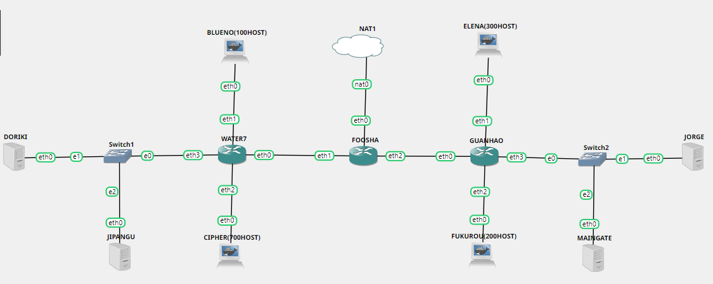

Keterangan:
- Doriki adalah DNS Server

    Untuk menjadikan Doriki sebagai DNS Server: 

    1. Install bind9
     
      ```
      apt-get update
      apt-get install bind9 -y
      ```

    2. Ubah konfigurasi pada file `/etc/bind/named.conf.options` dengan uncomment forwarders dan mengubah IPnya dan tambahkan `allow-query{any;};` di isi file tersebut, isi file sebagai berikut :
        ```
        options {
            directory "/var/cache/bind";

        //  If there is a firewall between you and nameservers you want
        //  to talk to, you may need to fix the firewall to allow multiple
        //  ports to talk.  See http://www.kb.cert.org/vuls/id/800113

        //  If your ISP provided one or more IP addresses for stable
        //  nameservers, you probably want to use them as forwarders.
        //  Uncomment the following block, and insert the addresses replacing
        //  the all-0's placeholder.

            forwarders {
                192.168.122.1;
            };
            allow-query{any;};

        //=====================================================================$
        //  If BIND logs error messages about the root key being expired,
        //  you will need to update your keys.  See https://www.isc.org/bind-keys
        //=====================================================================$
        //  dnssec-validation auto;

            auth-nxdomain no;    # conform to RFC1035
            listen-on-v6 { any; };
        };
        ```
        
        Setelah itu restart service dns dengan menggunakan command `service bind9 restart`.
        
- Jipangu adalah DHCP Server

    Untuk menjadikan Jipangu sebagai DHCP Server:

    1. Install DHCP
      
      
        ```
        apt-get update
        apt-get install isc-dhcp-server -y
        ```
      
      
    2. Ubah konfigurasi pada file `isc-dhcp-server` pada directory `/etc/default/isc-dhcp-server` dan tambahkan `eth0` di bagian `INTERFACES=`, isi file sebagai berikut :
        ```
         Defaults for isc-dhcp-server initscript
        # sourced by /etc/init.d/isc-dhcp-server
        # installed at /etc/default/isc-dhcp-server by the maintainer scripts

        #
        # This is a POSIX shell fragment
        #

        # Path to dhcpd's config file (default: /etc/dhcp/dhcpd.conf).
        #DHCPD_CONF=/etc/dhcp/dhcpd.conf

        # Path to dhcpd's PID file (default: /var/run/dhcpd.pid).
        #DHCPD_PID=/var/run/dhcpd.pid

        # Additional options to start dhcpd with.
        #       Don't use options -cf or -pf here; use DHCPD_CONF/ DHCPD_PID instead
        #OPTIONS=""

        # On what interfaces should the DHCP server (dhcpd) serve DHCP requests?       
        #       Separate multiple interfaces with spaces, e.g. "eth0 eth1".
        INTERFACES="eth0"
        ```
        Setelah itu restart service dhcp dengan menggunakan command `service isc-dhcp-server restart`.
        
- Maingate dan Jorge adalah Web Server
- Jumlah Host pada Blueno adalah 100 host
- Jumlah Host pada Cipher adalah 700 host
- Jumlah Host pada Elena adalah 300 host
- Jumlah Host pada Fukurou adalah 200 host

## **B. Subnetting**

Karena kalian telah belajar subnetting dan routing, Luffy ingin meminta kalian untuk membuat topologi tersebut menggunakan teknik CIDR atau VLSM. setelah melakukan subnetting.

Pada praktikum kali ini digunakan metode subnetting VLSM. Pembagian subnet ada pada gambar di bawah:

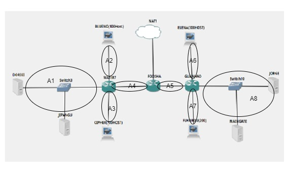

| Subnet  | Jumlah IP | Netmask  |
| ------------- | ------------- | ------------- | 	       
| A1  | 3  | /29 |
| A2  | 101  | /25 |
| A3  | 701  | /22 |
| A4  | 2  | /30 |
| A5  | 2  | /30 |
| A6  | 301  | /23 |
| A7  | 201  | /24 |
| A8  | 3  | /29 |
| **Total**  | **1314**  | **/21** |

Kemudian dilakukan perhitungan dengan tree untuk mendapatkan NID masing-masing subnet:

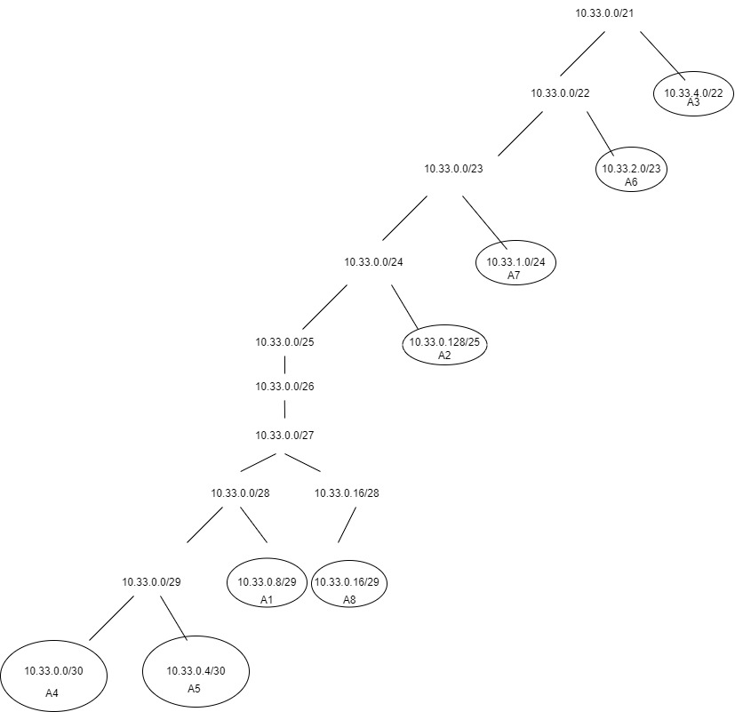

Hasil Perhitungan : 

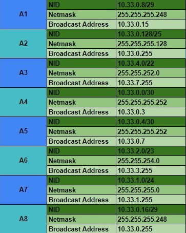

Untuk melakukan static subnetting hanya dilakukan untuk Router, DNS Server, DHCP Server, dan Web Server. Dikarenakan semua host akan diberi IP oleh DHCP server.

Untuk masing-masing network configuration sebagai berikut :

**Foosha**

```
 auto eth0
 iface eth0 inet dhcp

auto eth1
iface eth1 inet static
	address 10.33.0.1
	netmask 255.255.255.252

auto eth2
iface eth2 inet static
	address 10.33.0.5
	netmask 255.255.255.252

```

**Water7**

```
auto eth0
iface eth0 inet static
	address 10.33.0.2
	netmask 255.255.255.252

auto eth1
iface eth1 inet static
	address 10.33.0.129
	netmask 255.255.255.128

auto eth2
iface eth2 inet static
	address 10.33.4.1
	netmask 255.255.252.0

auto eth3
iface eth3 inet static
	address 10.33.0.9
	netmask 255.255.255.248
```

**Guanhao**

```
auto eth0
iface eth0 inet static
	address 10.33.0.6
	netmask 255.255.255.252

auto eth1
iface eth1 inet static
	address 10.33.2.1
	netmask 255.255.254.0

auto eth2
iface eth2 inet static
	address 10.33.1.1
	netmask 255.255.255.0

auto eth3
iface eth3 inet static
	address 10.33.0.17
	netmask 255.255.255.248

```

**Doriki**

```
auto eth0
iface eth0 inet static
	address 10.33.0.10
	netmask 255.255.255.248
	gateway 10.33.0.9
```

**Jipangu**

```
auto eth0
iface eth0 inet static
	address 10.33.0.11
	netmask 255.255.255.248
	gateway 10.33.0.9
```

**Jorge**

```
auto eth0
iface eth0 inet static
	address 10.33.0.18
	netmask 255.255.255.248
	gateway 10.33.0.17
```

**Maingate**

```
auto eth0
iface eth0 inet static
	address 10.33.0.19
	netmask 255.255.255.248
	gateway 10.33.0.17
```

## **C. Routing**

Kalian juga diharuskan melakukan Routing agar setiap perangkat pada jaringan tersebut dapat terhubung.

Routing dilakukan pada Foosha, Water7, dan Guanhao. Foosha akan melakukan routing pada seluruh subnet yang belum terhubung ke Foosha. Untuk Water7 dan Guanhao hanya perlu melakukan default routing.

**Foosha** :

```
##DORIKI n JIPANGU
route add -net 10.33.0.8 netmask 255.255.255.248 gw 10.33.0.2
##BLUENO
route add -net 10.33.0.128 netmask 255.255.255.128 gw 10.33.0.2
##CIPHER
route add -net 10.33.4.0 netmask 255.255.252.0 gw 10.33.0.2
##JORGE n MAINGATE
route add -net 10.33.0.16 netmask 255.255.255.248 gw 10.33.0.6
##ELENA
route add -net 10.33.2.0 netmask 255.255.254.0 gw 10.33.0.6
##FUKUROU
route add -net 10.33.1.0 netmask 255.255.255.0 gw 10.33.0.6
```

**Water7** :

```
route add -net 0.0.0.0 netmask 0.0.0.0 gw 10.33.0.1
```

**Guanhao** :

```
route add -net 0.0.0.0 netmask 0.0.0.0 gw 10.33.0.5
```

## **D. DHCP Server dan DHCP Relay**

Tugas berikutnya adalah memberikan ip pada subnet Blueno, Cipher, Fukurou, dan Elena secara dinamis menggunakan bantuan DHCP server. Kemudian kalian ingat bahwa kalian harus setting DHCP Relay pada router yang menghubungkannya.

Untuk memberikan ip kepada subnet Blueno, Cipher, Fukurou, dan Elena secara dinamis, di Jipangu buka file `dhcpd.conf` pada directory `/etc/dhcp/` dan tambahkan konfigurasi sebagai berikut : 

```
subnet 10.33.0.128 netmask 255.255.255.128 {
    range 10.33.0.130 10.33.0.255;
    option routers 10.33.0.129;
    option broadcast-address 10.33.0.255;
    option domain-name-servers 10.33.0.10;
    default-lease-time 360;
    max-lease-time 720;
}

subnet 10.33.0.8 netmask 255.255.255.248 {
}

subnet 10.33.4.0 netmask 255.255.252.0 {
    range 10.33.4.2 10.33.4.255;
    option routers 10.33.4.1;
    option broadcast-address 10.33.7.255;
    option domain-name-servers 10.33.0.10;
    default-lease-time 360;
    max-lease-time 720;
}
subnet 10.33.2.0 netmask 255.255.254.0 {
    range 10.33.2.2 10.33.2.255;
    option routers 10.33.2.1;
    option broadcast-address 10.33.3.255;
    option domain-name-servers 10.33.0.10;
    default-lease-time 360;
    max-lease-time 720;
}

subnet 10.33.1.0 netmask 255.255.255.0 {
    range 10.33.1.2 10.33.1.255;
    option routers 10.33.1.1;
    option broadcast-address 10.33.1.255;
    option domain-name-servers 10.33.0.10;
    default-lease-time 360;
    max-lease-time 720;
}
```

Setelah itu restart service dhcp dengan menggunakan command `service isc-dhcp-server restart`.

Dhcp relay dilakukan di Water7, Foosha, dan Guanhao.

1. Install DHCP relay
   ```
   apt-get update
   apt-get install isc-dhcp-relay -y
   ```
2. Ubah konfigurasi pada file `isc-dhcp-relay` pada directory `/etc/default/` dan ubah pada bagian `SERVERS=` mengarah ke IP DHCP server dan `INTERFACES=` sesuai dengan router masing-masing.
   
   **Water7**
   
   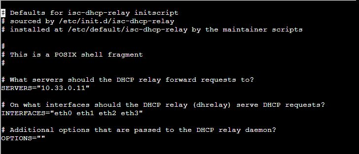

   **Foosha**
   
   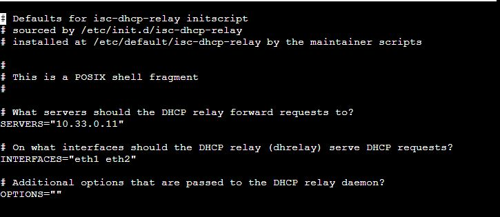
   
   **Guanhao**
   
   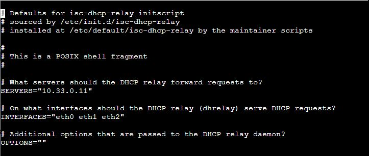
   
   Setelah selesai restart DHCP relay dengan command `service isc-dhcp-relay restart`.
   
## **Soal 1**

Agar topologi yang kalian buat dapat mengakses keluar, kalian diminta untuk mengkonfigurasi Foosha menggunakan iptables, tetapi Luffy tidak ingin menggunakan MASQUERADE.

**Pembahasan:**

## **Soal 2**
Kalian diminta untuk mendrop semua akses HTTP dari luar Topologi kalian pada server yang merupakan DHCP Server dan DNS Server demi menjaga keamanan.

**Pembahasan:**

## **Soal 3**
Karena kelompok kalian maksimal terdiri dari 3 orang. Luffy meminta kalian untuk membatasi DHCP dan DNS Server hanya boleh menerima maksimal 3 koneksi ICMP secara bersamaan menggunakan iptables, selebihnya didrop.

**Pembahasan:**

Pada node Jipangu (DHCP Server) dan Doriki (DNS Server) jalankan script berikut:

```
iptables -A INPUT -p icmp -m connlimit --connlimit-above 3 --connlimit-mask 0 -j DROP
```

Setelah itu uji dengan cara ping ke Jipangu dan Doriki dari keempat client. Pada ping keempat, maka ping tidak berhasil.

1. Ping ke Jipangu

    - Blueno

    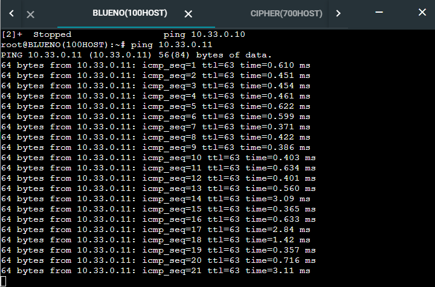

    - Cipher

    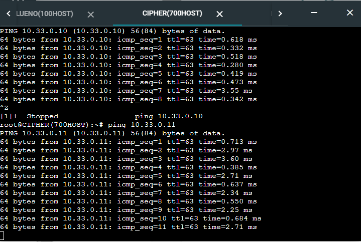

    - Elena
  
    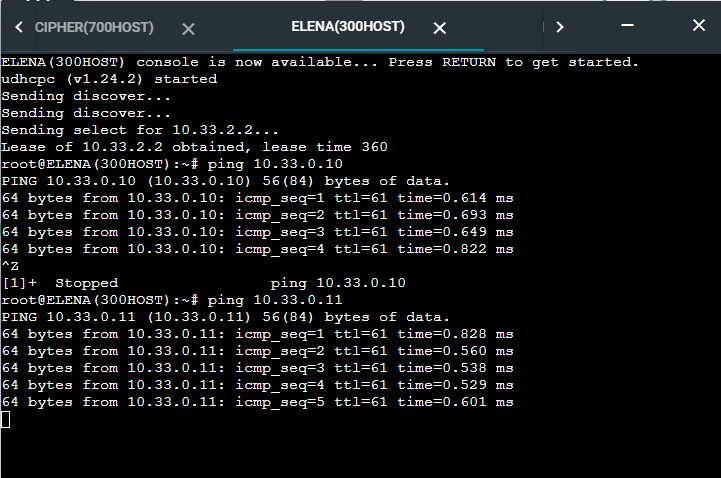

    - Fukurou

    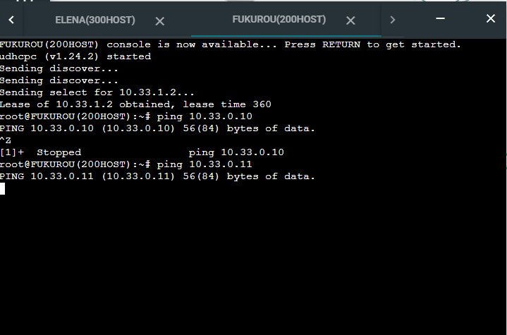

2. Ping ke Doriki

    - Blueno

    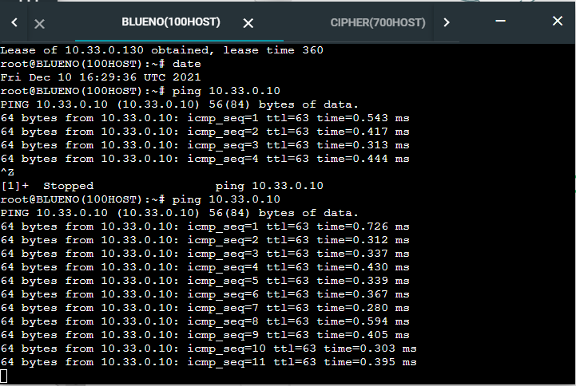

    - Cipher

    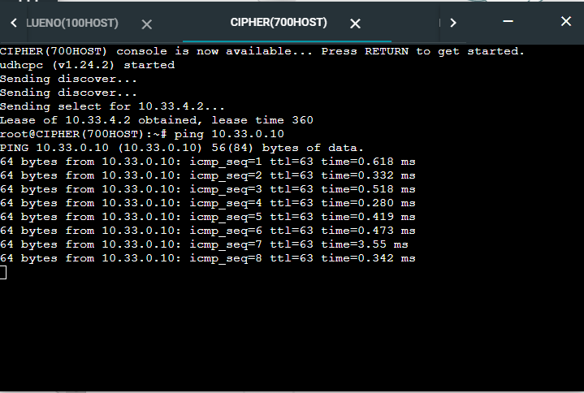

    - Elena

    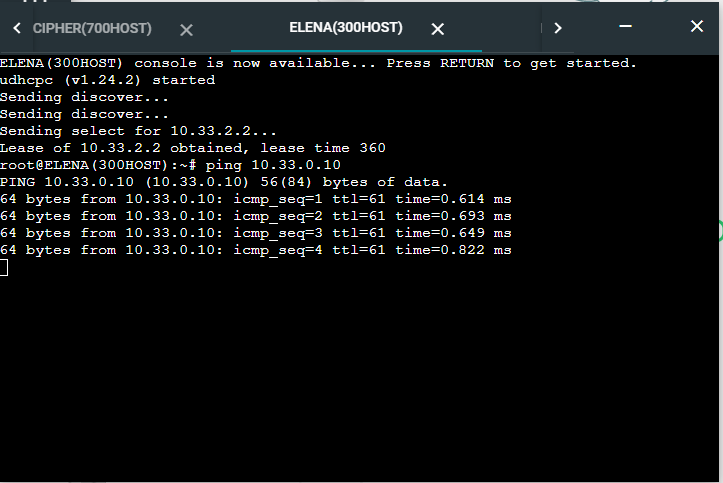

    - Fukurou

    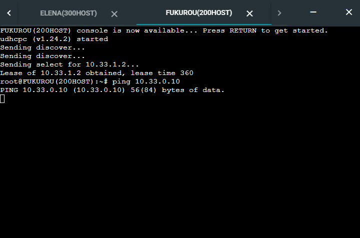

## **Soal 4**	
Kemudian kalian diminta untuk membatasi akses ke Doriki yang berasal dari subnet Blueno, Cipher, Elena dan Fukuro dengan beraturan sebagai berikut
Akses dari subnet Blueno dan Cipher hanya diperbolehkan pada pukul 07.00 - 15.00 pada hari Senin sampai Kamis.

**Pembahasan:**

Pada node Doriki jalankan script berikut:

```bash
#blueno:
iptables -A INPUT -s 10.33.0.128/25 -m time --timestart 07:00 --timestop 15:00 --weekdays Mon,Tue,Wed,Thu -j ACCEPT
iptables -A INPUT -s 10.33.0.128/25 -j REJECT
```

```bash
#cipher
iptables -A INPUT -s 10.33.4.0/22 -m time --timestart 07:00 --timestop 15:00 --weekdays Mon,Tue,Wed,Thu -j ACCEPT
iptables -A INPUT -s 10.33.4.0/22 -j REJECT
```

Setelah itu uji dengan cara ping ke Doriki dari Blueno dan Cipher pada tanggal yang sesuai dan tidak sesuai.

1. Pada tanggal yang sesuai (Selasa, 7 Desember 2021 Pukul 09.00)

    ```bash
    date -s "7 DEC 2021 09:00:00"
    ```

    - Blueno

    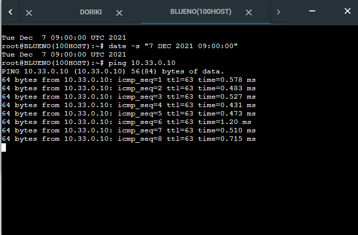

    - Cipher

    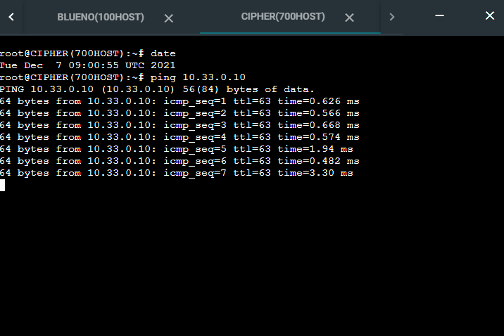

2. Pada tanggal yang tidak sesuai (Selasa, 7 Desember 2021 Pukul 20.00)

    ```bash
    date -s "7 DEC 2021 20:00:00"
    ```

    - Blueno

    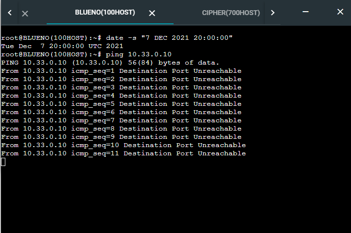

    - Cipher

    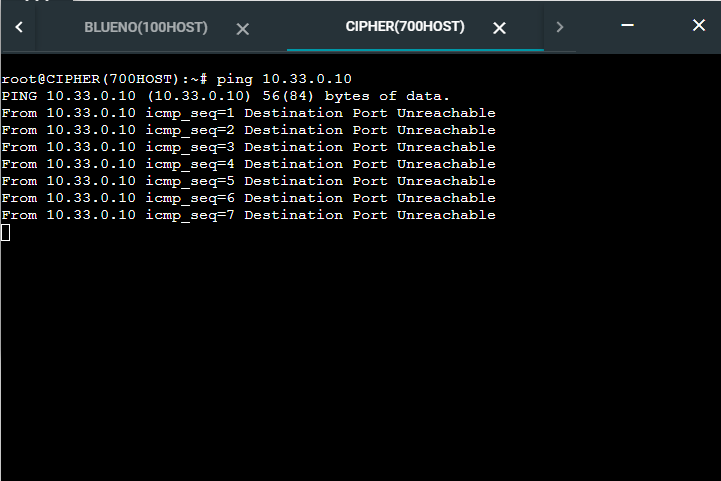


## **Soal 5**
Akses dari subnet Elena dan Fukurou hanya diperbolehkan pada pukul 15.01 hingga pukul 06.59 setiap harinya. Selain itu di reject.

**Pembahasan:**

Pada node Doriki jalankan script berikut:

```bash
#elena
iptables -A INPUT -s 10.33.2.0/23 -m time --timestart 07:00 --timestop 15:00 -j REJECT
```

```bash
#fukurou
iptables -A INPUT -s 10.33.1.0/24 -m time --timestart 07:00 --timestop 15:00 -j REJECT
```

Setelah itu uji dengan cara ping ke Doriki dari Elena dan Fukurou pada tanggal yang sesuai dan tidak sesuai.

1. Pada tanggal yang sesuai (Selasa, 7 Desember 2021 Pukul 20.00)

    ```bash
    date -s "7 DEC 2021 20:00:00"
    ```

    - Elena

    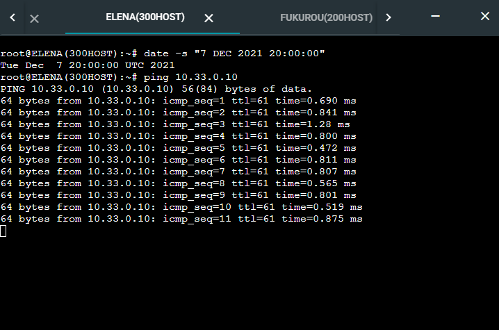

    - Fukurou

    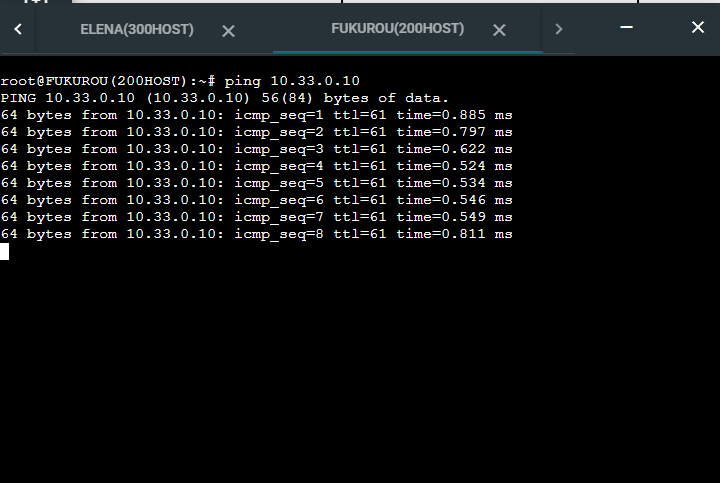

2. Pada tanggal yang tidak sesuai (Selasa, 7 Desember 2021 Pukul 09.00)

    ```bash
    date -s "7 DEC 2021 09:00:00"
    ```

    - Elena

    

    - Fukurou

    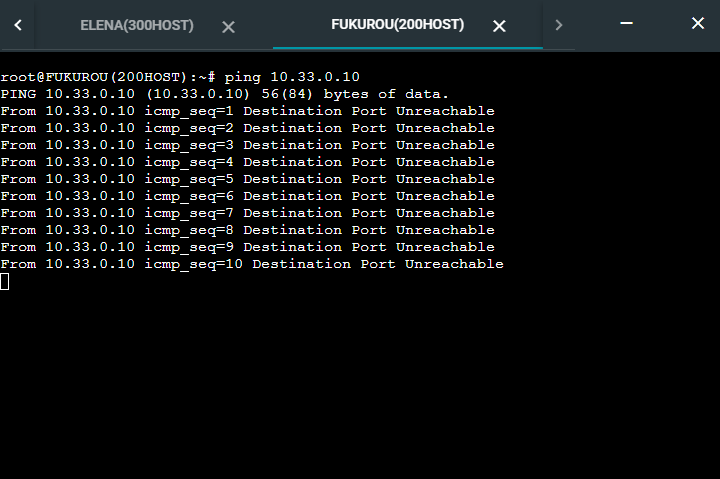

## **Soal 6**
Karena kita memiliki 2 Web Server, Luffy ingin Guanhao disetting sehingga setiap request dari client yang mengakses DNS Server akan didistribusikan secara bergantian pada Jorge dan Maingate.

**Pembahasan:**
